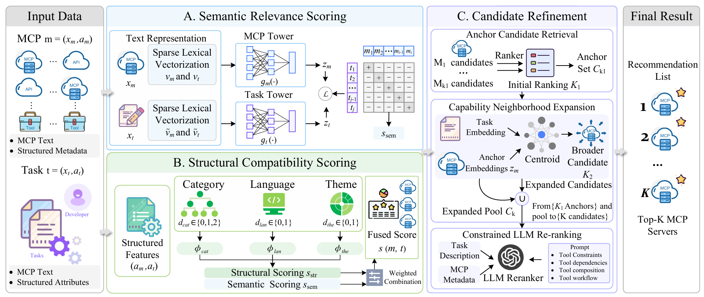

# From Language to Action: Enhancing LLM Task Efficiency with Task-Aware MCP Server Recommendation

This repository contains three closely connected parts for task-aware MCP server recommendation in LLM-based development workflows: **Task2MCP**, a task-oriented benchmark dataset; **T2MRec**, a task-to-MCP recommendation model; and **T2MAgent**, an interactive recommendation prototype. The overall goal is to support developers and LLM-based agents in selecting suitable MCP servers for concrete software development tasks.

## 📁 Project Structure

```text
Task2MCP/
├── data/
│   ├── mcp_merged.json                    # Merged MCP metadata
│   ├── mcp_raw.json                       # Raw MCP server records
│   ├── mcp_task.csv                       # Curated task–MCP associations
│   ├── mcp_task_all.csv                   # Complete task–MCP association set
│   └── task_raw.json                      # Raw task collection
├── T2MAgent/
│   ├── api_server.py                      # Backend service for the recommendation agent
│   ├── generate_task_mcp_top10_info.py    # Generation of Top-k task–MCP results
│   └── index-chat.html                    # Web interface for agent interaction
├── T2MRec/
│   ├── main_T2MRec.py                     # Main script for model training and evaluation
│   └── task_mcp_embedding.csv             # Precomputed embedding features
└── T2MRec.png                             # Architecture of T2MRec
```

## 1. Task2MCP: Dataset

**Task2MCP** is a task-centered dataset designed for MCP server recommendation research. It organizes development tasks together with curated MCP server candidates, providing a reproducible benchmark for retrieval and ranking.


###  Dataset Overview
- **Scale**: ~8K MCP servers overall, with 5,642 high-quality curated MCP servers and 4,800 tasks
- **Attributes**: normalized MCP metadata and NIST-based task annotations
- **Sources**: public MCP directories, GitHub repositories, and human-validated task–MCP associations
- **Applications**: task-oriented MCP recommendation, retrieval and ranking evaluation, and MCP agent research

## 2. T2MRec: Method
**T2MRec** is the core recommendation model of this repository. It formulates task-to-MCP recommendation as a retrieval-and-ranking problem and combines semantic relevance with structural compatibility.



### Quick Start

Please use the following commands to create and activate the environment:

```bash
conda create -n T2MRec python=3.8
conda activate T2MRec
pip install -r requirements.txt
```

To quickly test T2MRec, simply run:
```bash
cd T2MRec
python main_T2MRec.py \
  --use_two_tower 1 \
  --loss_type contrastive \
  --epochs 200 \
  --lr 1e-3 \
  --temperature 0.07 \
  --alpha_semantic 0.9 \
  --use_llm_selfcheck 0
```  
## 3. T2MAgent: Agent Prototype

**T2MAgent** is an interactive prototype built on top of T2MRec. It turns offline recommendation results into a conversational workflow, helping users obtain MCP server suggestions together with brief explanations and usage guidance.

### Quick Start

Prepare the T2MRec result file:

```bash
python generate_task_mcp_top10_info.py
```

Optional: configure an OpenAI-compatible model service:

```bash
export TASK2M_AGENT_API_KEY="your_api_key"
export TASK2M_AGENT_BASE_URL="your_base_url"
export TASK2M_AGENT_MODEL="your_model_name"
```

Start the backend:

```bash
python api_server.py
```

By default, the service runs on `0.0.0.0:8001`.  
For the frontend, set `API_BASE_URL` in `index-chat.html` to the backend address, then open the page in a browser.

## 📚 Citation

If you use Task2MCP in your research, please cite it as:

```bibtex
@misc{he2026languageactionenhancingllm,
      title={From Language to Action: Enhancing LLM Task Efficiency with Task-Aware MCP Server Recommendation}, 
      author={Shiyu He and Zhiman Chen and Yuqi Zhao and Neng Zhang and Ran Mo and Yutao Ma},
      year={2026},
      eprint={2604.17234},
      archivePrefix={arXiv},
      primaryClass={cs.SE},
      url={https://arxiv.org/abs/2604.17234}, 
}
